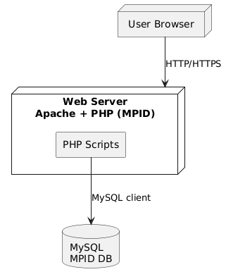
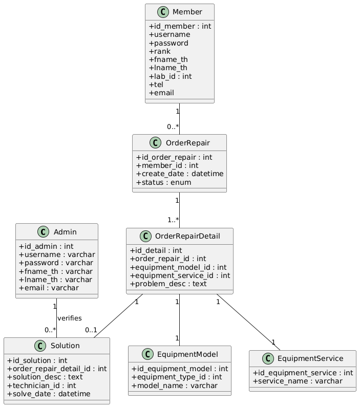
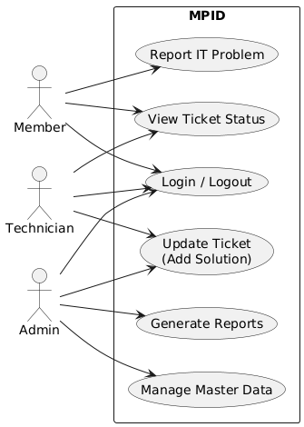
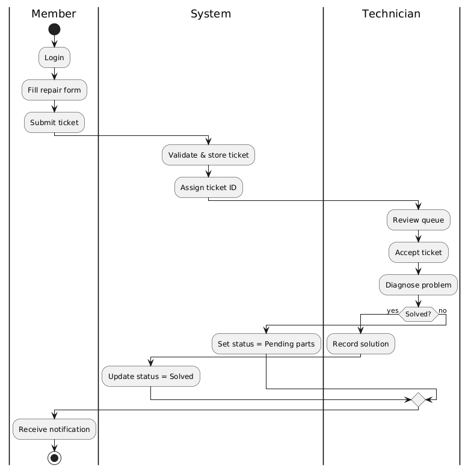

# MPID – Management System for Receiving IT Problem Notifications

ระบบเว็บแอปพลิเคชันสำหรับรับแจ้งปัญหาการใช้งานอุปกรณ์ IT ภายใน **กรมจเรทหารอากาศ**

> **ชื่อเต็ม:** Management system to receive notified problems in the use of information technology inside Directorate of Inspector General Royal Thai Air Force
> **ชื่อย่อ:** MPID

---

## ฟังก์ชันหลักของระบบ

- ระบบแจ้งซ่อมอุปกรณ์ IT (แจ้งผ่านฟอร์มออนไลน์)
- ระบบจัดการข้อมูลอุปกรณ์/แผนก/กอง
- ตรวจสอบสถานะใบแจ้งซ่อมย้อนหลัง
- เจ้าหน้าที่สามารถบันทึกวิธีแก้ไข/แนบไฟล์/ให้สถานะ "ซ่อมเสร็จแล้ว"
- รองรับผู้ใช้หลายระดับ (Admin, Technician, Member)
- รายงานตามช่วงเวลา / ประเภทปัญหา / สถานะ

---

## เทคโนโลยีที่ใช้

- Backend: PHP 5 (Procedural PHP)
- Database: MySQL (MyISAM)
- UI: HTML + CSS + JS + Adobe Dreamweaver CS6
- Hosting: Apache (LAMP Stack)

---

## โครงสร้างโปรเจกต์

| โฟลเดอร์ / ไฟล์ | คำอธิบาย |
|------------------|-----------|
| `css/`           | Stylesheets |
| `js/`            | JavaScript ฟังก์ชัน |
| `images/`        | ไอคอน + รูปภาพประกอบ |
| `db/`            | ไฟล์ SQL ของระบบ |
| `table-sql/`     | ตารางอธิบายฟิลด์ของแต่ละตาราง |

---

## Diagram ทั้งหมด

### Architecture Diagram
> โครงสร้างระบบ (Client → Web → DB)



---

### Class Diagram
> ความสัมพันธ์ของข้อมูลในระบบ (Entity/Relationship)



---

### Use-Case Diagram
> แสดงบทบาทผู้ใช้และหน้าที่ที่สามารถทำได้ในระบบ



---

### Activity Diagram
> Flow การทำงานของระบบ ตั้งแต่ผู้ใช้กรอกใบแจ้งซ่อม → ถึงขั้นตอนการแก้ไข



---

## ขั้นตอนติดตั้งและใช้งาน (สำหรับ Dev)

```bash
# 1. Clone repo นี้
git clone https://github.com/your-username/mpid.git
cd mpid

# 2. Import Database
mysql -u root -p < db/db_project.sql

# 3. แก้ไขไฟล์ connect.php (ใส่ host/user/password)

# 4. Start Server (กรณีใช้ PHP built-in)
php -S localhost:8080

# 5. เข้าระบบ
http://localhost:8080
```

**Default Admin Login:**
> Username: `admin`
> Password: `admin123`

---

## สิ่งที่ควรปรับปรุง (เหตุที่ไม่ได้ปรับปรุงเพราะเป็นระบบเก่าตอนทำโปรเจคจบ)

- แยกเป็น MVC (เช่น Laravel) เพิ่ม maintainability
- ใช้ PostgreSQL + Foreign Key Constraints
- ใส่ JWT/Auth Middleware
- แปลง UI เป็น SPA (React หรือ Next.js)
- เพิ่ม Docker, CI/CD, Unit Tests
